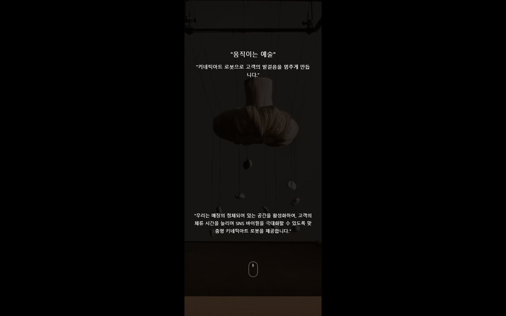
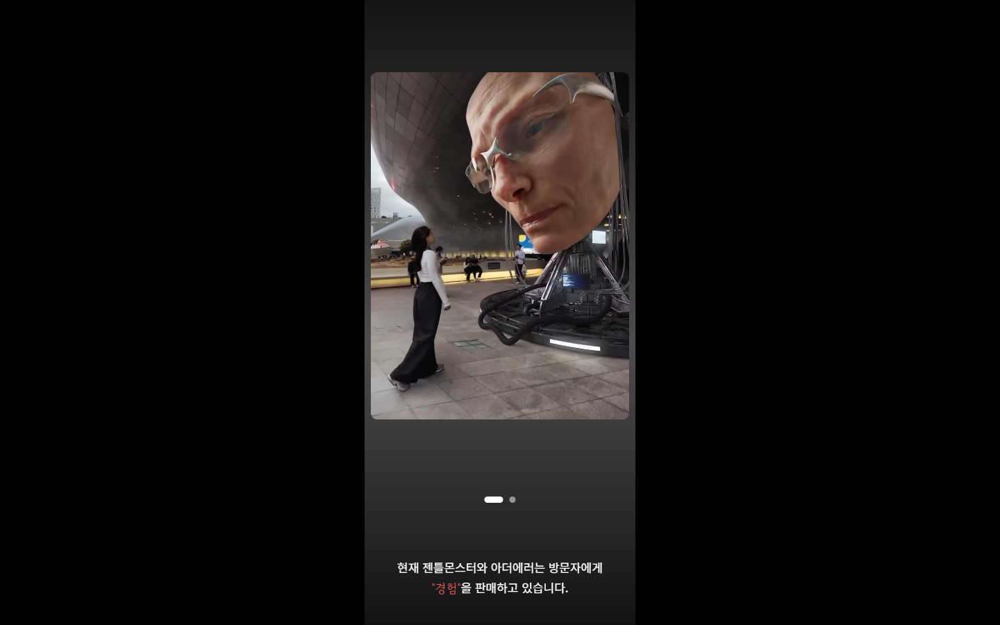
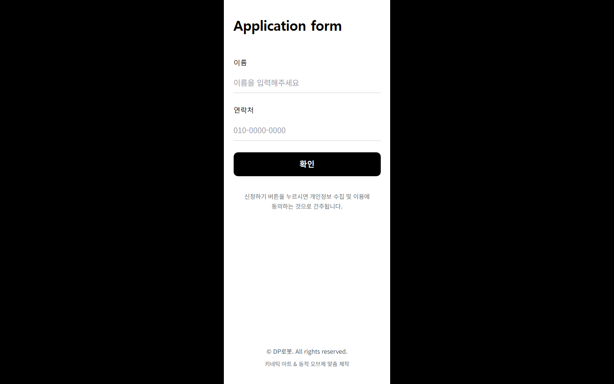

# DP로봇 — 키네틱 아트 & 동적 오브제 랜딩페이지

**"공간의 정적을 깨고, 고객의 머무름을 유지하는 단 하나의 오브제."**
브랜드 무드에 맞춘 맞춤형 키네틱 아트(움직이는 오브제) 제작 서비스의 원페이지 랜딩페이지입니다.

- **Stack**: Next.js 14 (App Router) · TypeScript · Tailwind CSS · Framer Motion
- **분석**: Google Analytics (`@next/third-parties`)
- **폼 연동**: 신청 폼 → Google Apps Script Web App → Google Sheets 저장 (`googleapis`)

## 실제 구동 화면

`npm run dev`로 직접 실행한 뒤 캡처한 실제 화면입니다 (모바일 390px 폭 기준).


*히어로(`Hero`) — 동영상 배경 위에 "움직이는 예술" 카피와 브랜드 도전 메시지.*


*브랜드 소개(`BrandIntro`) — 젠틀몬스터·아더에러 사례를 이미지 캐러셀로 보여주며 "경험을 판매한다"는 레퍼런스 제시.*


*신청 폼(`ApplicationForm`) — 이름/연락처 입력 후 제출하면 Google Sheets로 저장되는 리드 수집 폼.*

## 페이지 구성

`src/app/page.tsx` 기준 섹션 순서 (모바일 우선, 최대 폭 390px):

| 섹션 | 컴포넌트 | 내용 |
| --- | --- | --- |
| 1 | `Hero` | 동영상 배경 히어로 |
| 2 | `BrandChallenge` | 브랜드가 겪는 문제(정적인 공간) 제시 |
| 3 | `BrandIntro` | 젠틀몬스터 / 아더에러 등 레퍼런스 브랜드 소개 |
| 4 | `DeadSpace` | "멈춰있는 공간은 죽은 공간" 메시지 섹션 |
| 5 | `BrandShowcase` | 브랜드 링크 카드 |
| 6 | `Gallery` | 해외 키네틱 아트 사례 갤러리 |
| 7 | `KineticTrend` | 키네틱 아트 트렌드/사례 소개 |
| 8 | `BrandMessage` | 브랜드 메시지 |
| 9 | `CustomMade` | 맞춤 제작 안내 |
| 10 | `ApplicationForm` | 이름/연락처 신청 폼 (Google Sheets로 저장) |

## 폼 제출 흐름

```
ApplicationForm (이름, 연락처)
  → POST /api/submit-to-sheet
  → GOOGLE_SCRIPT_WEB_APP_URL (Google Apps Script Web App)
  → Google Sheets에 행 추가
```

## 환경 변수

`.env.local`에 아래 값을 설정해야 신청 폼이 동작합니다.

```env
GOOGLE_SCRIPT_WEB_APP_URL=https://script.google.com/macros/s/xxx/exec
```

## 실행

```bash
npm install
npm run dev      # http://localhost:3000
npm run build
npm start
```

## 디렉터리 구조

```
src/
  app/
    page.tsx                       # 섹션 조합
    api/submit-to-sheet/route.ts   # 신청 폼 → Sheets 프록시 API
  components/                      # 섹션별 컴포넌트 (Hero, BrandIntro, Gallery ...)
public/
  images/                          # 섹션 배경/레퍼런스 이미지
  videos/                          # 히어로 배경 영상, 갤러리 영상
```
